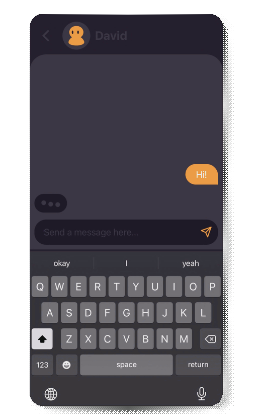
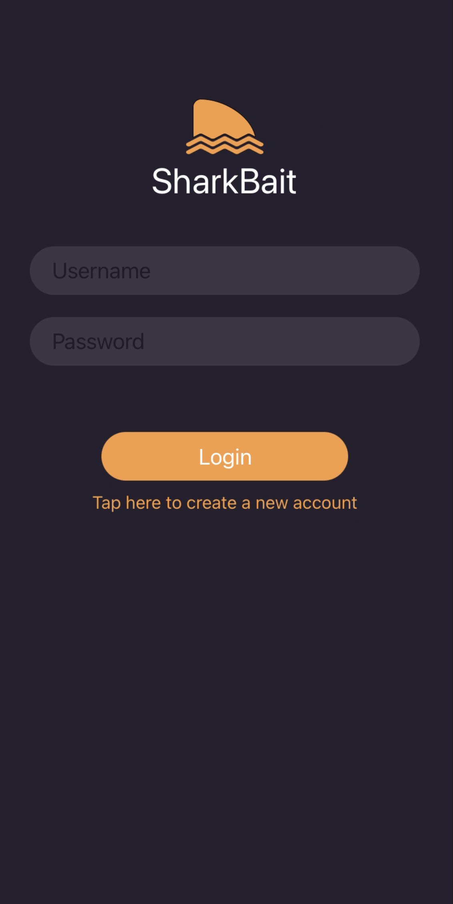
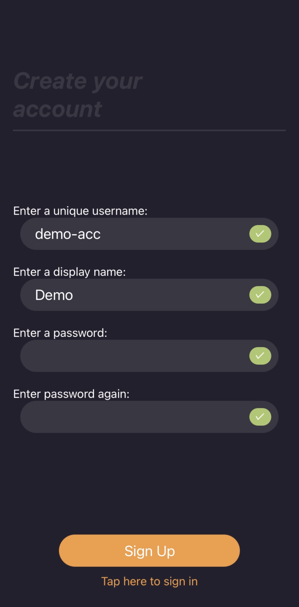
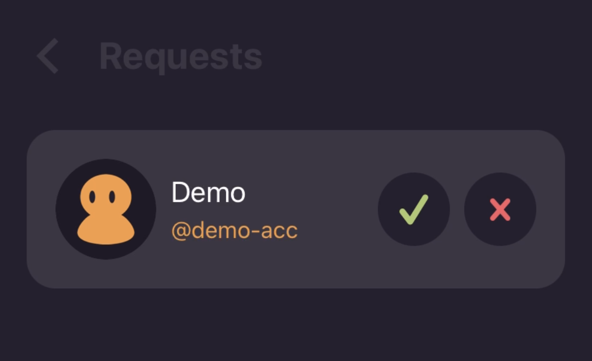
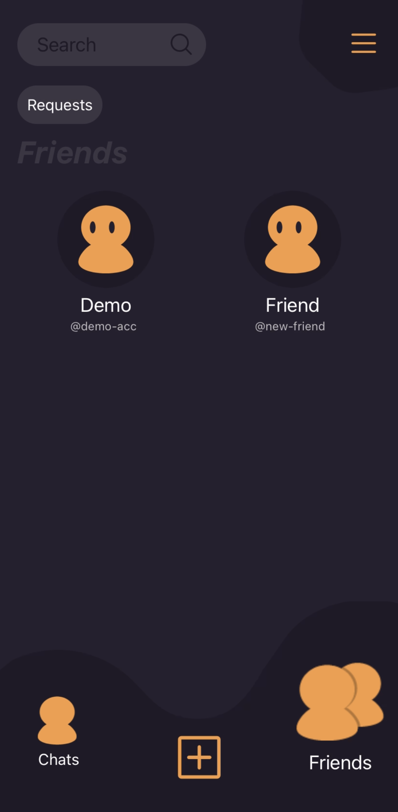
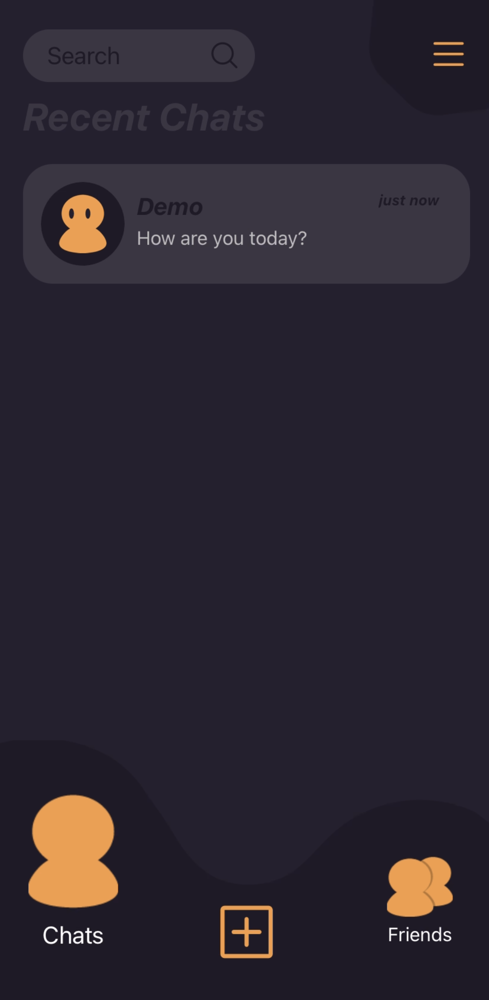
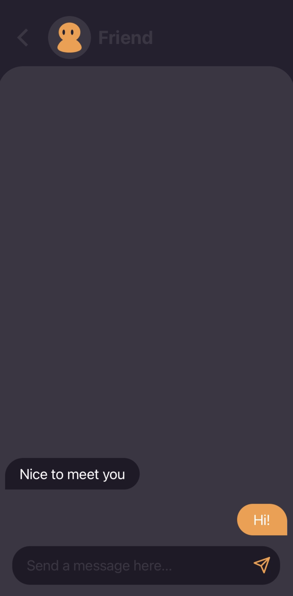
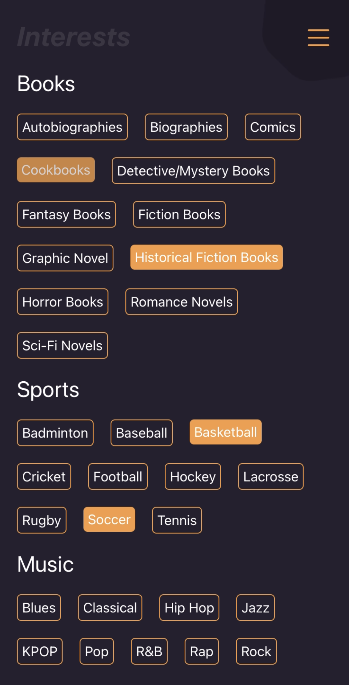
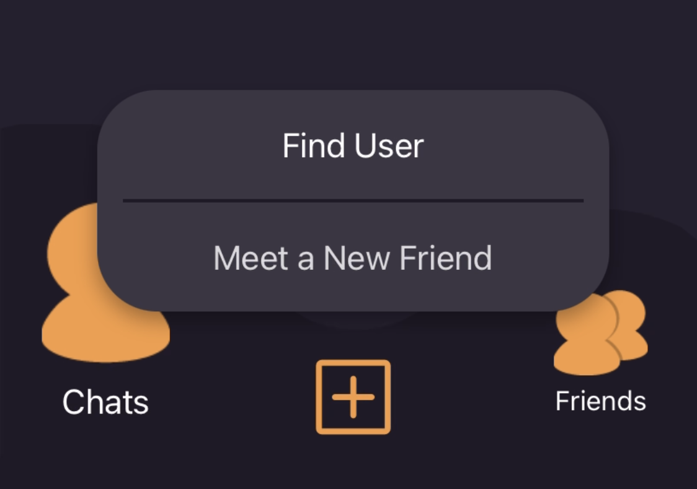

  <h1> SharkBait</h1>

  

    
     
    <em>Real time communication app made  for Android and iOS</em>
  

## :sparkles: Features

    
User System

     
    

        
        
    

     
    
A full featured user system which allows anyone to create an account and log in to their account to see their profile, friends and messages.

    
The login checks for a non-case-sensitive username and matching password with the database and shows an error if no matches are found.

    
The register page checks for an alphanumeric username, with dots, dashes and underscores allowed. The display name can be any character up to a
    specified length, and the password must be a strong password with an upper-case and lower-case character, and a special character.

     

    
Friend System

     
    

        
        
    

     
    
The friend system allows any user to send a friend request to another user. Incoming requests can be seen from within the friends tab and there they
    have the option to view the potential friend's profile, accept the request, or reject the request. All friends will also appear in the friends tab.

     

    
Instant Messaging

     
    

        
        
    

     
    
Thanks to web sockets, messages sent to other users are received instantly. You can have a real time conversation with any of the friends you made. All
    of the different chats you have with friends are shown within the Chat tab, with the most recent chats shown at the top.

     

    
Profiles

     
    

        
    

     
    
Every user has their own profile, showing their profile picture, name and any interests you have. When visiting another user's profile, you can also
    manage your friendship status with them and send them a message directly from the profile.

     

    
Interests

     
    

        
        
    

     
    
Within the interests page, you can choose all your interests from a predetermined list of interests. This places those interests right within
    your profile. Additionally, using interests, you can choose to meet a completely random user with similar interests. Choosing this options takes
    you to your potential new friend's profile to send them a friend request and/or a message.

     

